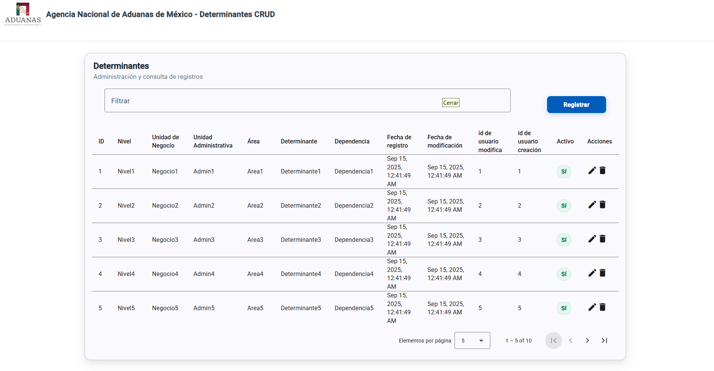

# ANAM – CRUD Determinantes 📌

##  Introducción 
Este repositorio corresponde al proyecto **ANAM CRUD Determinantes**, una aplicación web desarrollada con **Angular 19** que funciona como interfaz frontend para la **Agencia Nacional de Aduanas de México (ANAM)**.  

El propósito principal de este sistema es gestionar las  **“Determinantes”** mediante una interfaz CRUD (Crear, Leer, Actualizar y Eliminar). La aplicación está diseñada con un enfoque de **componentes de Angular** y aprovecha **Angular Material** para la construcción de tablas, formularios y elementos de navegación.  

Aunque actualmente funciona como un prototipo **solo de frontend**, la estructura está preparada para integrarse en un futuro con un backend real. El sistema incorpora funcionalidades avanzadas de manejo de datos como:
- Filtrado en tiempo real  
- Ordenamiento por columnas  
- Paginación configurable  

Con esto se busca simular un entorno de administración de datos más cercano al que utilizaría un sistema gubernamental en producción.  

---

##  Arquitectura del sistema
La aplicación sigue una arquitectura basada en **componentes de Angular**.  

El **componente principal** es `ListDeterminantesComponent`, que se encarga de mostrar y gestionar la tabla de determinantes con todas sus operaciones CRUD y utilidades de filtrado, ordenamiento y paginación.

---

## Modelo de la entidad principal
La entidad **Determinante** es el modelo central de la aplicación y representa las **clasificaciones administrativas** dentro de la jerarquía organizacional de la ANAM.  

A continuación se describen sus campos:

| Campo               | Tipo    | Descripción                               | Requerido |
|---------------------|---------|-------------------------------------------|-----------|
| id                  | number  | Identificador único                       | Opcional  |
| nivel               | string  | Nivel organizacional                      | Requerido |
| unidadDeNegocio     | string  | Clasificación de la unidad de negocio     | Requerido |
| unidadAdministrativa| string  | Unidad administrativa                     | Requerido |
| area                | string  | Área departamental                        | Requerido |
| determinante        | string  | Valor principal de determinante           | Requerido |
| dependencia         | string  | Relación de dependencia                   | Requerido |
| fechaDeRegistro     | Date    | Fecha de creación                         | Opcional  |
| fechaDeModificacion | Date    | Fecha de última modificación              | Opcional  |
| idUsuarioModifica   | number  | ID del usuario que modificó               | Opcional  |
| idUsuarioCreacion   | number  | ID del usuario que creó                   | Opcional  |
| activo              | boolean | Indicador de estado activo                | Opcional  |
| acciones            | string  | Acciones disponibles (editar, borrar, etc.) | Requerido |

---

##  Vista de la aplicación

Aquí se muestra la tabla principal de determinantes:

##  Interfaz principal
La interfaz de usuario principal está implementada en **`ListDeterminantesComponent`**, que incluye:

### 🔹 Encabezado y diseño
- Logo de la ANAM en `/logo_anam.png`.  
- Título de la aplicación: *“Agencia Nacional de Aduanas de México - Determinantes CRUD”*.  
- Estructura de navegación (rutas de prueba).  

### 🔹 Funcionalidades de manejo de datos
- **Filtrado**: búsqueda en tiempo real mediante `applyFilter($event)` al escribir en la barra de búsqueda.  
- **Ordenamiento**: habilitado en columnas clave como `nivel` y `area` usando la directiva `matSort`.  
- **Paginación**: configurable con tamaños de página `[5, 10, 25, 100]` y botones de primera/última página.  
- **Operaciones CRUD**:  
  - Botón *Registrar* para crear un nuevo determinante.  
  - Iconos de edición y borrado en cada registro.  

### 🔹 Estructura de la tabla
La tabla de datos despliega **13 columnas** que corresponden directamente con las propiedades de la interfaz `Determinante`. Estas incluyen:
- **Campos de negocio**: `id`, `nivel`, `unidadDeNegocio`, `unidadAdministrativa`, `area`, `determinante`, `dependencia`.  
- **Campos de auditoría**: `fechaDeRegistro`, `fechaDeModificacion`, `idUsuarioModifica`, `idUsuarioCreacion`.  
- **Campos de estado**: `activo` (con indicadores visuales) y `acciones`.  

---

##  Tecnologías utilizadas
- **Angular 19**: framework principal para la aplicación.  
- **Angular Material**: librería de componentes UI (`mat-table`, `mat-card`, `mat-form-field`, `mat-paginator`, `mat-icon`).  
- **TypeScript**: lenguaje principal para el desarrollo tipado.  
- **Angular Router**: sistema de navegación (parcialmente implementado).  
- **Bootstrap 5**: estilos adicionales para la presentación.  
- **Font Awesome 6**: íconos para acciones (editar, borrar, etc.).  

---

##  Contexto del proyecto
Este sistema está diseñado como parte de una práctica social y tiene como base un caso de uso de la **Agencia Nacional de Aduanas de México**.  

##  Cómo poner en marcha el proyecto

A continuación se describen los pasos necesarios para ejecutar el proyecto de manera local en una computadora. El repositorio corresponde únicamente al **frontend**, por lo que no requiere conexión con un backend para visualizar su funcionamiento.

### 1. Clonar el repositorio
Para descargar el código fuente desde GitHub, se utiliza el siguiente comando en la terminal:

`git clone https://github.com/cuevasedu04/ANAM-CRUD-DETERMINANTES.git ` 

### 2. Acceder a la carpeta del proyecto

Dentro del repositorio existe la carpeta frontend/ que contiene el código de la aplicación. Entramos en ella con:

`  cd ANAM-CRUD-DETERMINANTES/frontend ` 

### 3. Instalar dependencias

El proyecto está desarrollado en Angular 19, por lo que se necesita tener instalado previamente Node.js (versión 20) y Angular CLI.

Para instalar todas las librerías necesarias se ejecuta:

` npm install `

### 4. Levantar el servidor de desarrollo

Para iniciar la aplicación en modo desarrollo:

` ng serve -o ` o ` npm start `

Este comando abrirá automáticamente la aplicación en el navegador en la dirección:

` http://localhost:4200/ `

### 5. Generar la versión de producción

En caso de que se quiera compilar la aplicación y obtener los archivos listos para desplegar en un servidor:

` ng build `

El resultado se guardará en la carpeta dist/.
